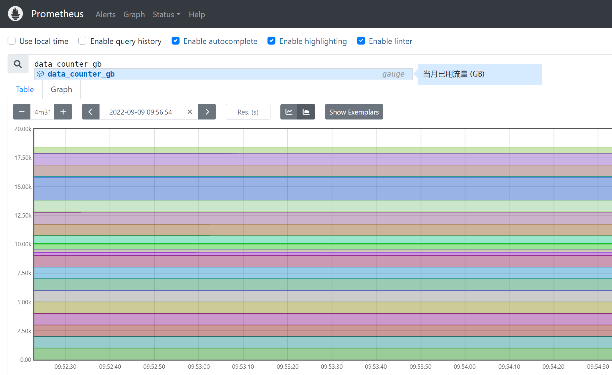
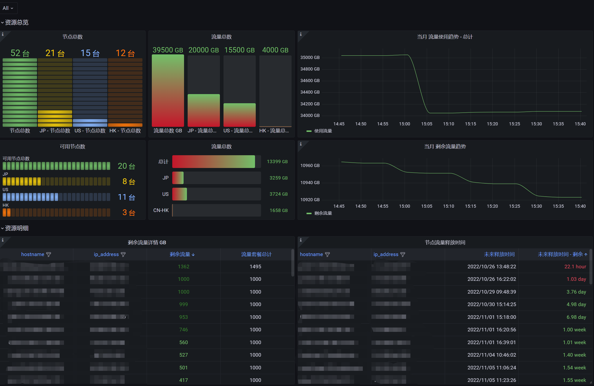

# bandwagonhost cloud exporter
A Prometheus exporter for [bandwagonhost cloud](https://bandwagonhost.com/).

Mertrics api exposing bandwagonhost server information. [mertrics example](./doc/mertrics_example)

## usage
Example
```
version=v0.1
wget https://github.com/weiqiang333/bandwagonhost_cloud_exporter/releases/download/${version}/bandwagonhost_cloud_exporter-linux-amd64-${version}.tar.gz
mkdir /usr/local/bandwagonhost_cloud_exporter
tar -zxf bandwagonhost_cloud_exporter-linux-amd64-${version}.tar.gz -C /usr/local/bandwagonhost_cloud_exporter
chmod +x /usr/local/bandwagonhost_cloud_exporter/bandwagonhost_cloud_exporter
/usr/local/bandwagonhost_cloud_exporter/bandwagonhost_cloud_exporter --config.file /usr/local/bandwagonhost_cloud_exporter/config/bandwagonhost_cloud_exporter.yaml
    # Don't forget to modify your config file /usr/local/bandwagonhost_cloud_exporter/config/bandwagonhost_cloud_exporter.yaml
```
Flags
```
      --config.file string        exporter config file (default "./config/bandwagonhost_cloud_exporter.yaml")
      --exporter.address string   The address on which to expose the web interface and generated Prometheus metrics. (default ":9103")
```

##### Docker Images
  Running bandwagonhost cloud exporter in containers.

  Available from [icyleaf](https://github.com/icyleaf/) engineers [docker images](https://github.com/icyleaf/docker-images/tree/master/bandwagonhost-exporter).


---
## prometheus
- config prometheus.yml
```yaml
scrape_configs:
  - job_name: bandwagonhost_cloud
    honor_timestamps: true
    scrape_interval: 15m
    scrape_timeout: 30s
    metrics_path: /metrics
    scheme: http
    follow_redirects: true
    enable_http2: true
    static_configs:
      - targets:
          - localhost:9103
```
- query prometheus. [mertrics example](./doc/mertrics_example)


## grafana
The following [Dashboard template](./doc/data/grafana.json), can be imported into grafana to get an basic dashboard.

Example:

